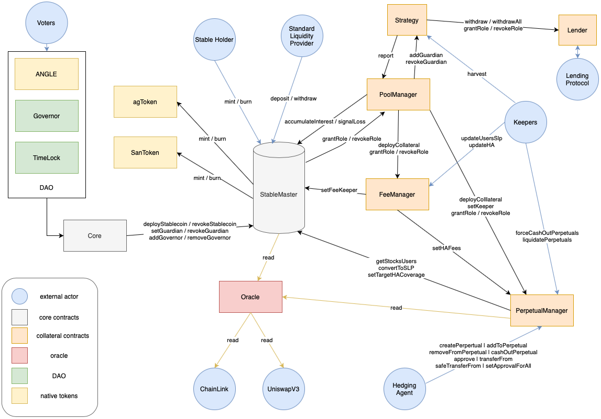

# angle-interfaces

## Description

This repo contains the interfaces for interacting with the core contracts of Angle Protocol.

It is split in three different files:

- `IAngle.sol`: contains the user-facing functions of the contracts of the protocol
- `IAngleGovernance.sol`: contains the functions for which only the different governor addresses (and in some cases the guardian) addresses are allowed
- `IAngleKeeper.sol`: lists for each contract the different functions with which keepers can interact to perform actions that are beneficial to the protocol

## Protocol Architecture

The smart contracts of the protocol are structured with the architecture below:

They will soon be made open-source.

## Further Information

For more info about the protocol:

* [Docs](https://docs.angle.money)
* [Twitter](https://twitter.com/AngleProtocol)
* [Discord](https://discord.gg/9EKFec2MBm)

